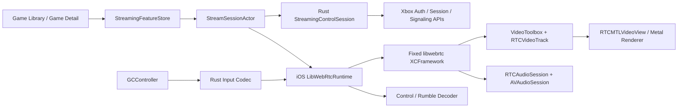

# iOS libwebrtc 云串流接入规划

## Problem Framing

- iOS 游戏库已经具备浏览、详情和稳定游戏身份，云串流入口需要使用 `streamTitleId` 启动真实 xCloud 会话。
- 仓库已经沉淀 Xbox 鉴权、session、排队、configuration、SDP/ICE、keepalive、控制通道协议、诊断词典和桌面端实战数据，这些资产可以直接复用。
- 桌面 `rust-owned` 运行时基于 `rtc 0.9` primitives，并长期维护 packet、frame、NACK、bootstrap、recovery、decode、present 闭环。iOS 主线采用完整 libwebrtc 接收栈，把协议复杂度交给成熟上游。
- 首期目标固定为 iOS xCloud：`游戏详情 Play -> streaming token -> Xbox session ready -> libwebrtc 协商 -> 首帧/音频 -> 手柄输入 -> 稳定退出`。
- xHome Remote Play、麦克风、触摸控制、HDR、HEVC/AV1 和桌面 RTC 迁移进入后续阶段。

成功结果包含三层：

1. 产品层：用户从游戏库进入游戏、看到清晰进度、可以取消、可以恢复、可以稳定退出。
2. 运行时层：libwebrtc 完整拥有标准 RTC 数据面，Rust 与 Swift 保持清晰边界和单一生命周期 owner。
3. 交付层：固定源码版本、可重复构建、可诊断、可灰度、可回滚、可完成 App Store 合规审查。

## Current Constraints

### Repository decisions

- iOS 使用原生 SwiftUI，独立 Xcode target 保持现有桌面构建链稳定。
- Xbox HTTP、认证、session、signaling、策略编译和协议 DTO 位于 Rust。
- RTC 数据面使用固定版本 libwebrtc。
- VideoToolbox、Metal、AVAudioSession、GCController 和 iOS 生命周期位于 Swift/Objective-C++ 平台层。
- `StreamingRuntime.swift` 已建立 `connect`、`disconnect` 与 cloud/console target 骨架，后续扩展围绕这一稳定入口进行。
- `xbox-ios-bridge` 已有 UniFFI、Tokio、设备/模拟器 Rust 构建脚本，可承接 opaque streaming control session。

关键证据链：

- [`2026-07-13-native-ios-app-bootstrap.md`](../rfcs/2026-07-13-native-ios-app-bootstrap.md)：固定 iOS SwiftUI、Rust 控制面、libwebrtc 数据面和平台媒体边界。
- [`ios-xcloud-library-data-alignment.md`](./ios-xcloud-library-data-alignment.md)：固定 `productId / streamTitleId / xboxTitleId` 语义和串流入口前置条件。
- [`2026-05-19-rust-webrtc-library-reassessment.md`](../rfcs/2026-05-19-rust-webrtc-library-reassessment.md)：区分 transport/API 与完整 receive pipeline，推荐用 libwebrtc 验证成熟接收闭环。
- [`2026-06-11-official-xbox-webrtc-startup-comparison.md`](../reports/2026-06-11-official-xbox-webrtc-startup-comparison.md)：固化官方 session、SDP、ICE、H.264、feedback 和 DataChannel 行为基线。
- [`StreamingRuntime.swift`](../../iosapp/XBXRC/Platform/Streaming/StreamingRuntime.swift)：现有 iOS streaming runtime 骨架。

### Existing assets and required work

| 资产 | 当前状态 | 本轮动作 |
| --- | --- | --- |
| 游戏库入口 | 页面、详情、TitleHub 身份已完成 | 接入 xCloud catalog 的 `streamTitleId` 与 Play 行为 |
| iOS 鉴权 | Web Token、Keychain、session generation 已完成 | 启动时按需生成 streaming token，token 只驻留 Rust 内存 |
| `xbox-streaming` | session plan、queue、state、signaling、ICE 规范化、keepalive 已完成 | 抽取宿主无关 control session，增加 iOS UniFFI facade |
| `xbox-webapi` | session 与 SDP/ICE API 已完成 | 复用现有 API，补齐 iOS 所需 typed error 与 cancellation |
| iOS streaming | 只有协议骨架 | 建立 `StreamSessionActor`、libwebrtc adapter、播放器和状态投影 |
| 桌面 browser runtime | 已有标准 `RTCPeerConnection` 成功基线 | 作为 SDP、ICE、data channel、stats 与体验对照 |
| 桌面 Rust runtime | 拥有完整自管 receive/recovery/trace | 作为故障词典和诊断参考，接收链实现留在桌面主线 |

### Protocol and behavior constraints

- 官方 Xbox 会话顺序采用：create session、poll state、取得 configuration、创建 PeerConnection、交换 SDP、交换 ICE、等待 connected、keepalive、close。
- 视频首期固定 H.264，音频固定 Opus；真实 answer 需要验证 profile-level-id、packetization-mode、RTX apt 和 RTCP feedback。
- 标准反馈覆盖 REMB、transport-cc、FIR、NACK、PLI；实际触发策略以固定 libwebrtc commit 的真机会话为准。
- DataChannel 至少覆盖 `input`、`control`、`message`，channel id、ordered、reliability 和 protocol 字段使用桌面 fixture 锁定。
- cloud 首期使用 `streamTitleId`，`productId` 保持目录主键，`xboxTitleId` 保持账户活动关联键。

### Security and privacy constraints

- refresh token、JWK seed、Web Token 保存在 Keychain `WhenUnlockedThisDeviceOnly`。
- streaming token、GS token、TURN credential 和 remote session handle 保存在 Rust 内存对象。
- Swift 接收 plan、状态与 SDP/ICE 交换结果；诊断投影统一脱敏，完整凭据始终留在 Rust 控制面。
- 日志按字段过滤 token、完整 SDP、ICE 地址、设备名、账号身份和 session id。
- 麦克风权限在功能进入范围时按需申请；首期保持接收音频与手柄输入。

### Delivery constraints

- libwebrtc 需要覆盖 iPhone Device 与 Apple Silicon Simulator。
- 构建产物需要固定 commit、GN 参数、Xcode 版本、补丁、SHA-256、dSYM、许可证、第三方 NOTICE 和 SBOM。
- 真实账号、真实 region、真实 xCloud 标题和可控弱网环境是所有媒体与恢复结论的证据来源。
- 当前 iOS minimum deployment target 为 iOS 26，首期测试矩阵按这一基线设计。

## Options

### Option A：固定源码版本 libwebrtc，自建 XCFramework

- 核心：固定 Chromium/libwebrtc commit，使用 GN/Ninja 生成 Device/Simulator 产物，通过 Objective-C/Swift API 接入。
- 收益：完整 PeerConnection、ICE/TURN、DTLS/SRTP、SCTP、RTP/RTCP、TWCC/GCC、NACK/RTX、PLI/FIR、jitter、音视频接收与 RTCStats。
- 成本：构建链、二进制体积、版本升级、符号归档和第三方许可证需要长期维护。
- 适用：生产 canonical runtime。

### Option B：社区预编译 libwebrtc 包

- 核心：通过维护中的 Swift Package/CocoaPods 二进制快速接入 libwebrtc。
- 收益：PoC 启动快，可以优先验证 Xbox 互操作、H.264、DataChannel 与首帧。
- 成本：上游 commit、编译参数、补丁、符号、许可证和安全响应受发行者影响。
- 适用：时限明确的探索 PoC，产物在 G1 前切换到自建 XCFramework。

### Option C：WKWebView / WebKit `RTCPeerConnection`

- 核心：复用 WebKit 内置 WebRTC，在网页运行时承载媒体和 DataChannel。
- 收益：与桌面 `webrtc-direct` 代码和浏览器行为接近，适合快速互操作基线。
- 成本：系统版本耦合、原生 Metal/音频/手柄/lifecycle 控制粒度有限，诊断与发布策略受 WebKit 约束。
- 适用：对照实验和故障复现工具。

### Option D：GStreamer、webrtc-rs、str0m、libdatachannel

- GStreamer `webrtcbin` 适合由 GStreamer 统一拥有整条媒体 pipeline 的产品，当前工程会同时承担 GLib/plugin runtime 与既有平台媒体能力。
- webrtc-rs/`rtc` 与 str0m 适合 Rust-first、sans-I/O、自组媒体管线场景，接收恢复责任继续位于项目层。
- libdatachannel 适合轻量 PeerConnection/DataChannel 与基础媒体传输，完整浏览器级视频接收闭环仍需组合其他组件。
- 适用：专项实验与未来独立产品形态。

### Option comparison

| 维度 | A 固定版 libwebrtc | B 社区二进制 | C WebKit | D 其他库 |
| --- | --- | --- | --- | --- |
| 浏览器级接收闭环 | 完整 | 完整，版本由发行者决定 | 完整，版本由系统决定 | 组合式 |
| Xbox 互操作可控性 | 高 | 中 | 中 | 中低 |
| iOS H.264/VideoToolbox | 成熟 | 取决于构建 | 系统托管 | 需要组合 |
| Metal/原生 UI 集成 | 高 | 高 | 中 | 需要组合 |
| 诊断与版本指纹 | 高 | 中 | 中低 | 中 |
| 供应链可控性 | 高 | 中低 | 系统托管 | 中高 |
| 初始接入成本 | 高 | 低 | 低 | 中高 |
| 长期适配度 | 最高 | PoC 优先 | 基线工具 | 专项实验 |

## Recommended Direction

采用 Option A 作为生产主线，Option B 只服务最早期互操作 PoC。iOS 先完成固定版 libwebrtc runtime，桌面 RTC 迁移在 iOS 验收完成后建立独立 RFC 与 PoC。

### Target architecture



### Ownership model

| Owner | Responsibilities |
| --- | --- |
| `StreamingFeatureStore` (`@MainActor`) | 页面状态、用户动作、错误文案、播放器展示、HUD |
| `StreamSessionActor` (Swift actor) | session generation、启动顺序、取消、后台/前台、网络切换、资源释放 |
| Rust `StreamingControlSession` | token、region、plan、remote session、queue/state、SDP/ICE HTTP、keepalive、close |
| `LibWebRtcRuntime` | factory、PeerConnection、transceiver、DataChannel、local offer/candidate、remote answer/candidate、RTCStats |
| libwebrtc | ICE、DTLS、SRTP、SCTP、RTP/RTCP、TWCC/GCC、RTX/NACK、PLI/FIR、jitter、receiver/decode scheduling |
| iOS media adapters | VideoToolbox 输出、Metal 呈现、音频 session、route/interruption、controller/haptics |
| Rust protocol crates | 输入 frame 编码、control/message/rumble typed 解码、跨端协议 fixture |

每个异步命令、回调和统计快照携带 `accountGeneration + sessionGeneration + attemptId`。`StreamSessionActor` 只接受当前 generation 的结果，并按 `stop peer -> close remote session -> release token handle` 顺序释放资源。

### Stable contracts

建议把当前五态 `StreamingRuntimeState` 扩展为面向产品的阶段合同：

```text
idle
preparingAccess
creatingSession
queueing(position, estimatedWait)
waitingForConfiguration
negotiating
connecting
waitingForFirstFrame
playing
recovering(reason, attempt)
suspending
stopping
failed(code, retryability, userAction)
```

Rust bridge 输出以下稳定对象：

- `StreamingLaunchRequest`：`streamTitleId`、target kind、locale、用户配置和 account generation。
- `PreparedStreamingSession`：opaque handle、target、region 摘要、协商策略、ICE server 摘要和 session correlation id。
- `RemoteSignalingSnapshot`：answer、remote candidates、end-of-candidates、poll version。
- `StreamingControlSnapshot`：queue/state、keepalive、terminal reason、retry budget。
- `StreamingDiagnosticSnapshot`：脱敏控制面里程碑、错误类别和 build fingerprint。

Swift runtime 输出以下稳定事件：

- `localOfferReady`、`localCandidateReady`、`peerStateChanged`、`selectedPairChanged`。
- `dataChannelStateChanged`、`firstVideoPacket`、`firstDecodedFrame`、`firstPresentedFrame`、`firstAudioPlayout`。
- `statsUpdated`、`networkPathChanged`、`recovering`、`terminalError`、`stopped`。

### End-to-end launch flow

1. 用户在详情页点击 Play，UI 用 `streamTitleId` 创建 `StreamingLaunchRequest`。
2. `AuthStore` 串行刷新必要凭据，Rust 创建只驻留内存的 cloud access handle。
3. Rust 编译 session/negotiation/input/render plan，选择 token 默认 region。
4. Rust 创建 xCloud session，轮询 queue、provisioning、ready 和 configuration。
5. Swift 创建 `RTCPeerConnectionFactory` 与 PeerConnection，建立 audio `sendrecv`、video `recvonly` transceiver，并按 fixture 创建 Xbox DataChannel。
6. Swift 创建并设置 local offer，收集首批 candidate；Rust 提交 SDP 与 candidate。
7. Rust 轮询 remote answer 与 ICE；Swift按 poll version 幂等应用。
8. PeerConnection 进入 connected，DataChannel 进入 open，音视频 track 建立。
9. 首个 video frame 进入 `RTCMTLVideoView`，UI 从加载态原子切换到播放器；音频 session 同步进入播放态。
10. GCController 采样经 Rust protocol codec 编码，通过 input DataChannel 发送；control channel 回包经 typed decoder 处理震动与协议事件。
11. Rust keepalive 与 session monitor 持续运行，Swift 每秒采集 RTCStats 并生成统一诊断快照。
12. 用户退出、账号切换、terminal failure 或生命周期收口触发幂等 stop 与资源清理。

### Media strategy

#### Video

- MVP 直接使用 libwebrtc iOS H.264 decoder factory 与 VideoToolbox。
- 首轮渲染使用 `RTCMTLVideoView`，优先验证完整接收闭环、色彩、旋转、比例和首帧稳定性。
- 自定义 `RTCVideoRenderer` 只在效果、HUD 合成、呈现节奏或精确 submit/present 指标需要时进入第二阶段。
- 自定义 renderer 继续接收 libwebrtc 已解码 frame，pre-decode jitter、repair 和 keyframe feedback 始终归 libwebrtc。
- 后解码队列采用容量 1 的 latest-only mailbox，呈现层记录 local drop、frame age 和 display deadline。

#### Audio

- libwebrtc/RTCAudioSession 负责 Opus receive 与 playout，AVAudioSession 负责 category、route、interruption 和系统生命周期。
- MVP 覆盖扬声器、听筒策略、蓝牙/AirPods、有线设备、音量与静音。
- 麦克风、party chat 和 echo cancellation 在第二批进入范围。

#### Input and haptics

- GCController 负责设备发现、采样、热插拔与系统按键语义。
- Rust protocol codec 负责 Xbox input frame、序号、neutral baseline、control/message/rumble typed payload。
- input 发送从 channel open 开始，页面退出、controller disconnect 和 session generation 变化立即发送 neutral/停止事件并清空发送队列。
- 采样频率、去抖、重复边沿和 bufferedAmount 背压通过 fixture 与实机 trace 固化。

### Recovery model

- libwebrtc 负责 media recovery：jitter、NACK/RTX、PLI/FIR、TWCC/GCC、decoder keyframe gating。
- 应用层负责 lifecycle recovery：network path change、ICE restart、PeerConnection rebuild、remote session rebuild。
- 恢复动作按成本分四级：继续等待 libwebrtc、ICE restart、PeerConnection rebuild、Xbox session rebuild。
- 每级动作拥有证据、冷却、次数预算、成功边沿和 terminal 分类。
- 3 秒内存在新鲜 packet/decode/present 进展时保持当前 PeerConnection；selected pair 失败、ICE failed、远端 terminal 或明确超时进入升级动作。
- ReferenceChain、RecoveryLedger、cleanAnchorCommitted、DisplayStable 保留为跨运行时诊断词汇；iOS 以 RTCStats、decoded keyframe、fresh present 和 freeze episode 投影这些事实。

### Observability model

每个 session 记录：

- 控制面：tap、token ready、session created、queue ready、configuration ready、close settled。
- 建连：factory/peer created、offer ready、local candidates、answer applied、remote candidates、selected pair、connected。
- 网络健康：candidate type、protocol、RTT、loss、jitter、available bitrate、packets/bytes、NACK/PLI/FIR、ICE changes。
- 恢复链健康：freeze episode、keyframe decoded、fresh frame presented、ICE restart、peer rebuild、session rebuild、动作预算。
- media supply：received/decoded/rendered FPS、jitterBufferDelay、framesDropped、freezeCount、totalFreezesDuration。
- steady supply：连续稳定窗口、present age、audio concealment、A/V sync。
- submit/present 长尾：renderer callback、mailbox wait、submit、display tick、frame age 的 P50/P95/P99。
- 帧供给 delta：received→decoded、decoded→renderer、renderer→present 三段增量。
- 输入：sample、encode、send、DataChannel bufferedAmount、rumble receive/apply。

所有事件携带 `appBuild + libwebrtcCommit + xcframeworkSha + accountGeneration + sessionCorrelationId + attemptId`。完整 RtcEventLog 使用有界文件、显式用户导出和字段脱敏。

### Dependency and supply-chain policy

1. G0 选择经过 Xbox PoC 的 libwebrtc commit，并记录 Chromium milestone、源码 revision 和第三方依赖。
2. 固化 GN args、Xcode/SDK 版本、Device/Simulator 架构、bitcode/symbol、H.264 和 ObjC SDK 配置。
3. CI 生成 XCFramework、dSYM、NOTICE、SBOM 和 manifest，发布到受控 artifact storage。
4. Xcode 工程通过本地 Swift Package 或固定 artifact 引用，构建时校验 SHA-256。
5. Release 保存可符号化产物和精确 build fingerprint。
6. 常规升级采用季度窗口，安全修复进入加急窗口；每次升级完整执行互操作、网络损伤、性能和 soak gate。
7. 社区预编译包在 PoC 结束时退出生产依赖图。

### Delivery phases and gates

#### G0：范围、fixture 与基线，3–5 个工作日

工作包：

- 固化 xCloud-first、H.264/Opus、单手柄、接收音频、iPhone 首发范围。
- 从官方采集和桌面 browser runtime 固化 SDP、ICE、DataChannel、session progression 匿名 fixture。
- 记录同账号、同 region、同网络下 browser runtime 的启动、首帧、网络、freeze 和输入基线。
- 建立 iOS streaming RFC 的字段、owner、状态机和验收门。

出口门：

- `streamTitleId`、streaming token、region、session、signaling 的控制面合同获得确认。
- H.264 profile、RTX apt、RTCP feedback、DataChannel 参数都有匿名 fixture。
- 参考设备、网络、账号、标题和指标采集方式获得确认。

#### G1：libwebrtc artifact 与最小 PoC，1–2 周

工作包：

- 先用临时二进制完成 loopback 与 Xbox 互操作探针。
- 建立源码固定的 Device/Simulator XCFramework 构建。
- 接入最小 `LibWebRtcRuntime`，输出 offer、candidate、peer state、track、DataChannel 和 RTCStats。
- 验证 H.264/Opus、VideoToolbox、RTCMTLVideoView、input/control/message channels。

出口门：

- Device 与 Simulator CI 可重复生成或拉取 SHA 固定的 artifact。
- 真实 xCloud session 完成 offer/answer、ICE connected、视频首帧、音频首包、DataChannel open。
- 连续 start/stop 100 次无 crash、悬挂线程和持续内存增长。
- dSYM、NOTICE、SBOM、manifest 和 H.264/App Store 合规清单齐备。

#### G2：Rust control session 与端到端 cloud 启动，1–2 周

工作包：

- 在 `xbox-ios-bridge` 增加 opaque `StreamingControlSession`。
- 复用 `xbox-streaming` 的 plan、session flow、signaling、keepalive、retry budget 与 typed error。
- 建立 `StreamSessionActor`，落实 generation、cancellation 和幂等 stop。
- 游戏详情 Play 接入 preparing、queueing、connecting、first frame、failed、cancel 状态。

出口门：

- 游戏详情可启动真实标题并稳定进入首帧。
- queue、401 refresh、204 poll、timeout、用户取消、重复点击、账号切换均有确定状态与清理结果。
- 1000 次 fake signaling start/cancel/retry 测试无旧 generation 提交。
- 普通日志通过 secret 与隐私字段扫描。

#### G3：媒体、输入与完整会话体验，2 周

工作包：

- 完成播放器、方向/比例、安全区域、HUD、加载切换和错误体验。
- 完成 AVAudioSession route/interruption 和静音/音量。
- 完成 GCController、input codec、channel gate、neutral baseline、热插拔和 rumble。
- 完成锁屏、前后台、来电/音频中断、网络 path change 和系统内存告警策略。

出口门：

- 健康网络 1080p60 稳态 presented FPS 达到 58+，本地丢帧率低于 1%。
- AV sync 位于 ±50ms，音频 underrun 低于 0.1%。
- input sample→DataChannel send P95 低于 12ms。
- controller 热插拔、退出、重连和 generation 切换无卡键与重复边沿。
- 连续 60 分钟会话无资源泄漏、音频路由残留和播放器黑屏残留。

#### G4：恢复、诊断与弱网验收，2 周

工作包：

- 接入 RTCStats、selected pair、codec、freeze、NACK/PLI/FIR 和应用层恢复动作 trace。
- 建立 network、recovery、media supply、steady supply、submit/present、supply delta 六类 gate。
- 完成 direct、TURN fallback、ICE restart、IPv4/IPv6、Wi-Fi/蜂窝切换、短断网和服务端 terminal 测试。
- 建立有界 RtcEventLog、用户导出、崩溃符号和 build fingerprint。

出口门：

- remote ICE applied→connected 健康网络 P95 低于 3 秒。
- configuration ready→首帧 P95 低于 5 秒，queue/provisioning 单独统计。
- 1% 随机丢包、50ms RTT 连续 30 分钟保持 session。
- 5% burst loss 的 fresh present 恢复 P95 低于 1.5 秒。
- 3 秒短断网恢复 P95 低于 6 秒。
- ICE 零响应在 15 秒内进入 fallback 或 typed failure。
- 每次恢复可从 trace 还原证据、动作、结果与预算。

#### G5：TestFlight、性能与发布硬化，2–3 周

工作包：

- 覆盖最低支持设备、中档设备、当前高端设备和 iPad 探索样本。
- 完成 30 分钟、2 小时、4 小时 soak，记录 memory、thermal、battery、freeze 和 crash。
- 完成隐私清单、加密出口、H.264/第三方许可、App Store 权限文案和诊断授权审查。
- 建立 TestFlight feature gate、远端 kill switch、指标看板和版本回滚流程。

出口门：

- configuration ready 后首帧成功率达到 97% 以上。
- session 创建成功率达到 98% 以上。
- 30 分钟会话无意外终止率达到 99% 以上。
- crash-free session 达到 99.5% 以上。
- 10 小时聚合 soak 无持续内存增长，stop 后线程、audio session、controller 和网络任务回到基线。
- Release crash 可符号化到 Swift/ObjC++/libwebrtc/Rust bridge 调用点。

#### G6：灰度与稳定发布，至少 2 周观测

灰度顺序：

1. 开发者隐藏开关。
2. 内部 dogfood。
3. TestFlight 10%。
4. TestFlight 25%。
5. TestFlight 50%。
6. TestFlight 100%。
7. App Store 分阶段发布。

每级观察至少 48 小时。升级条件统一使用 G3–G5 指标、严重故障数、账号/region 分布和设备分层数据。kill switch 只控制串流入口可用性，凭据与用户数据始终保持本地安全边界。

### Test matrix

| 维度 | MVP 覆盖 |
| --- | --- |
| 设备 | 最低支持 iPhone、中档 iPhone、当前高端 iPhone；iPad 探索样本 |
| 系统 | iOS 26 当前小版本与 beta/下一小版本预检 |
| 网络 | Wi-Fi 5/6、蜂窝、IPv4、IPv6/NAT64、双 NAT、direct、TURN、Wi-Fi↔蜂窝 |
| 损伤 | RTT 20/50/100/200ms；loss 0/1/3/5%；jitter 0/10/30ms；reorder；burst loss |
| 会话 | 冷启动、热启动、排队、204 poll、401 refresh、远端终止、取消、重复点击、账号切换 |
| 媒体 | 720p30、1080p60、H.264 profile 变体、静音、蓝牙/有线 route、音频中断 |
| 输入 | Xbox、DualSense、MFi、热插拔、neutral、rumble、channel reopen |
| 生命周期 | Home indicator、锁屏、前后台、来电、内存告警、网络切换、系统音频抢占 |
| 发布 | Debug/Release、Device/Simulator、全新安装、升级、kill switch、符号化 |

自动化层级：

- Rust：plan、session state、signaling fixture、retry、generation、input/control codec 单元测试。
- Swift：actor state machine、cancellation、UI projection、lifecycle、stats projection XCTest。
- ObjC++/libwebrtc：factory、peer、callback thread、释放顺序、错误注入集成测试。
- fake Xbox：session、queue、SDP/ICE、terminal error 的端到端测试。
- 真机：真实 Xbox 账号、真实游戏、网络损伤、长跑、音频 route、controller 矩阵。

### Team and schedule

推荐核心配置：

- 1 名 iOS/媒体工程师：libwebrtc、VideoToolbox、Metal、AVAudioSession、GCController。
- 1 名 Rust/协议工程师：streaming token、control session、signaling、UniFFI、input/control codec。
- 1 名产品客户端工程师：SwiftUI player、状态、HUD、错误、生命周期与埋点。
- 1 名 QA/性能工程师阶段性参与：设备矩阵、弱网、soak、TestFlight 和发布门禁。

三名核心工程师并行时，iOS xCloud TestFlight beta 预计 8–12 周；单人串行预计 12–16 周。关键路径依次为 libwebrtc artifact、真实 Xbox 互操作、streaming token/control session、首帧/输入、弱网与发布合规。

### Risk register

| 风险 | 早期信号 | 控制措施 | 退出条件 |
| --- | --- | --- | --- |
| libwebrtc 构建链重 | artifact 波动、CI 超时、符号缺失 | 固定 commit/GN、预构建缓存、SHA、dSYM | G1 连续可重复构建 |
| Xbox SDP/profile 差异 | setRemoteDescription 失败、无首帧 | 官方/browser fixture、逐字段 SDP diff、真机抓取 | cloud 标题矩阵全部首帧 |
| H.264 硬解兼容 | software decode、色彩异常、frame drop | decoder factory 能力探针、设备矩阵、profile gate | 参考设备 1080p60 达 G3 |
| DataChannel 协议漂移 | channel open 后无输入/控制 | 桌面 fixture、二进制 golden tests、channel trace | input/control/message 全部回环 |
| Swift/Rust 双状态竞争 | 旧回调、重复 close、悬挂 keepalive | 单一 Swift actor、opaque Rust session、三重 generation | fake 1000 次无污染 |
| 后台与系统中断 | audio 残留、恢复黑屏、remote session 泄漏 | 明确 suspend/stop 表、grace window、幂等 cleanup | 生命周期矩阵通过 |
| 网络指标健康且显示停滞 | packet 增长、fresh present 缺失 | 六类 gate、first/fresh present、submit/present tail | trace 可定位单一层级 |
| Token/ICE 隐私泄漏 | 日志 secret scan 命中 | Rust 内存句柄、字段脱敏、有界导出、用户授权 | G2/G5 安全门通过 |
| 二进制体积增长 | IPA 超过预算 | GN 裁剪、按平台 artifact、symbol 外置 | G1 固化体积预算 |
| 上游升级回归 | commit 升级后互操作/性能下降 | 季度窗口、双 artifact canary、完整 gate | 新版本达全部 SLO |

### Desktop follow-on

iOS G5 完成后，为桌面建立独立 `libwebrtc runtime migration` RFC：

1. 固定同一 libwebrtc 基线和跨平台 C ABI。
2. 在 macOS 验证 VideoToolbox/Metal，在 Windows 验证 D3D11 decoder/presenter 或自定义 decoder factory。
3. 复用现有 browser `webrtc-direct` 作为发布回退和互操作基线。
4. 逐项迁移 RTCStats、input/control、audio、latest-only present 与 runtime trace。
5. libwebrtc 成为稳定默认后，删除自建 TWCC/BWE、packet buffer、NACK requester 和 pre-decode recovery 分支。

这条工作拥有独立风险、周期和发布门，iOS 项目保持单一 native libwebrtc runtime。

## Open Questions

以下问题采用默认决策推进，并在 G0/G1 用证据校正：

1. 首发范围：xCloud，xHome 进入后续里程碑。
2. 音频范围：接收播放进入 MVP，麦克风与 party chat 进入第二批。
3. 输入范围：单主手柄进入 MVP，触摸、多手柄、键鼠进入第二批。
4. 渲染范围：RTCMTLVideoView 进入 MVP，自定义 Metal renderer 由呈现指标触发。
5. 依赖来源：生产使用自建固定 XCFramework，社区二进制只服务 PoC。
6. 设备范围：iPhone 首发，iPad 完成探索验证后进入正式支持。
7. 遥测范围：本地 trace 与用户导出是基础能力，远端遥测需要服务端、隐私清单与显式授权。
8. 背景行为：进入后台执行有界 grace 与清理，前台恢复创建 fresh PeerConnection/session；画中画进入后续产品评估。
9. App Store 合规：G1 完成 H.264、第三方 NOTICE、加密出口、隐私和二进制来源审查。
10. libwebrtc commit：G1 PoC 从当前维护分支选择候选，最终 commit 由 Xbox 互操作、构建、性能和许可四项证据共同确定。

## Candidate Follow-On Tasks

1. **复杂任务：iOS 云串流与 libwebrtc runtime RFC**
   - 固化 owner、状态合同、UniFFI API、libwebrtc build、依赖合规、错误模型和 G0–G5 验收门。
2. **复杂任务：固定版 libwebrtc XCFramework 与 Xbox 互操作 PoC**
   - 跑通 H.264/Opus、SDP/ICE、DataChannel、首帧、RTCStats、100 次 start/stop。
3. **复杂任务：iOS streaming token 与 Rust control session**
   - 抽取 `xbox-streaming` 宿主无关 session，建立 opaque UniFFI handle、generation、cancellation 和 typed error。
4. **复杂任务：iOS xCloud 端到端播放器**
   - 从 `streamTitleId` 接入真实游戏，完成 Swift actor、libwebrtc runtime、播放器状态和幂等 cleanup。
5. **复杂任务：iOS 串流音频、手柄、控制通道与震动**
   - 接入 AVAudioSession、GCController、Rust protocol codec、channel gate 和 lifecycle。
6. **复杂任务：iOS 串流 trace、弱网 gate 与 TestFlight 灰度**
   - 建立六类质量 gate、网络矩阵、soak、安全/许可审查、kill switch 和版本看板。
7. **候选复杂任务：xHome Remote Play 接入**
   - 复用同一 runtime，增加主机发现、唤醒、local network 权限、home provisioning 和 direct/TURN 矩阵。
8. **候选复杂任务：桌面 libwebrtc runtime 迁移**
   - 以独立 RFC 验证 macOS/Windows 硬解、零拷贝、C ABI、双运行时灰度和旧 RTC 清理。

执行顺序锁定为：先完成 G0 的协议/范围基线，再完成 G1 的真实 xCloud libwebrtc 闭环。G1 同时裁决构建、互操作、媒体、许可和供应链五条关键路径。
