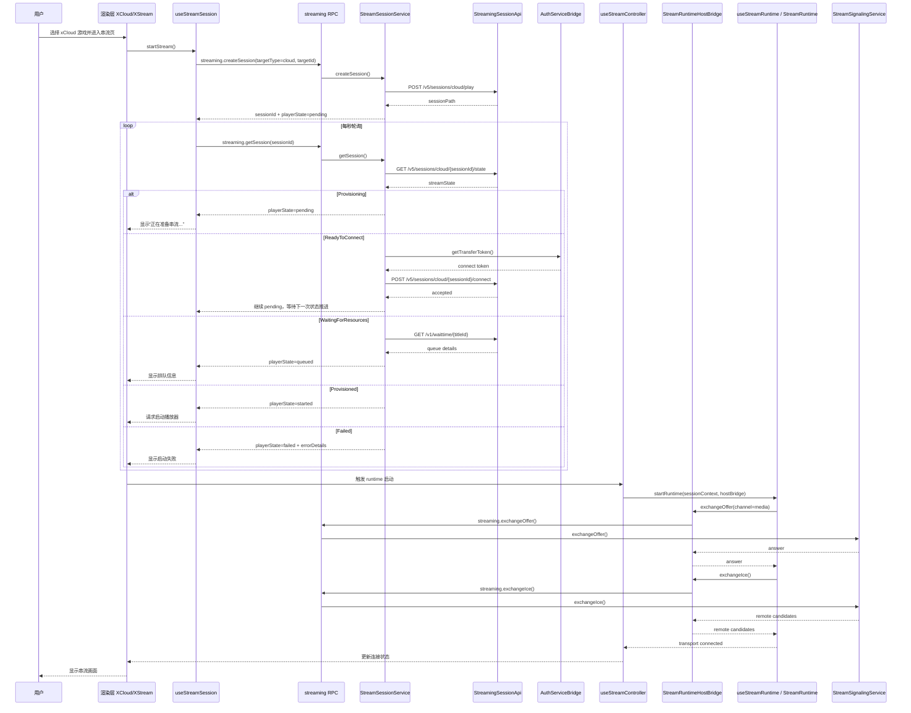

# xCloud 串流时序图

本文记录当前代码库中 xCloud 串流从点击游戏到播放器建立连接的关键时序，便于后续排障、回归和功能迭代时对照。

## 主链路

## 关键状态说明

- `Provisioning`
  说明上游会话已创建，但资源和连接前置条件还没准备好。前端显示“正在准备串流...”。

- `ReadyToConnect`
  说明上游要求客户端发送 `/connect` token。这个阶段是否能顺利推进，取决于 `AuthServiceBridge.getTransferToken()` 是否能拿到正确的 cloud transfer token。

- `WaitingForResources`
  说明会话进入排队或等待资源阶段。前端会切到排队文案，而不是启动播放器。

- `Provisioned`
  说明会话已经允许进入 WebRTC 协商。只有到这个状态，渲染层才会真正启动本地 runtime；后续 offer/ICE、ICE restart 与本地重连都由 runtime 通过 host bridge 自行完成。
