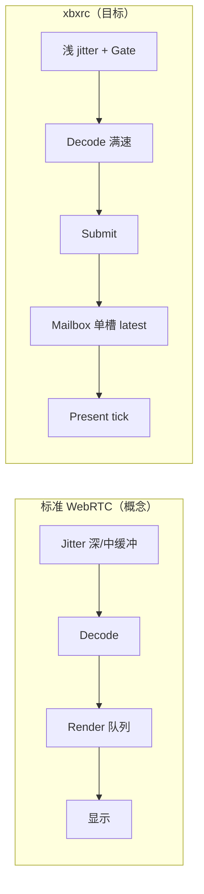

# 低延迟显示调度优化 RFC（不硬对齐 WebRTC）

> 说明：复杂任务在执行中的里程碑、状态、决策变更、阻塞项统一记录在本 RFC 内；仅在任务完全完成后再单独产出 Report。
>
> 关联 trace：`runtime-trace-1779701428966-1.jsonl`（~150s 稳态播放）、对照 `runtime-trace-1779699130686-1.jsonl`。
> 前置 RFC：[`2026-04-24-post-decode-latest-only-mailbox-convergence.md`](2026-04-24-post-decode-latest-only-mailbox-convergence.md)、[`2026-04-18-post-decode-display-scheduling-and-media-recovery-decoupling.md`](2026-04-18-post-decode-display-scheduling-and-media-recovery-decoupling.md)、[`2026-03-27-cloud-high-rtt-latency-first-recovery.md`](2026-03-27-cloud-high-rtt-latency-first-recovery.md)、[`2026-04-03-h264-bootstrap-semantics-and-trace-mislabel-fix.md`](2026-04-03-h264-bootstrap-semantics-and-trace-mislabel-fix.md)。

## Status

- Completion: 已完成（待新 trace 复验门禁）
- Current State: implemented
- Owner: Codex
- Last Updated: 2026-05-26

## Background

### 产品目标

- 云桌面 / 云游戏场景：**交互延迟优先**，宁可丢旧帧也要新画面；**不**以「present_fps 统计对齐 decode_fps」为成功标准。
- 传输仍走 WebRTC 族能力（RTP/RTX、NACK、PLI、TWCC、REMB），但 **decode 与 display 是两条调度线**，由 host latest-only mailbox 做最终呈现裁剪。

### Trace 证据（`1779701428966`，+54s 起播，中后段 +79s~+150s）

| 观测 | 数值 / 形态 | 含义 |
|------|-------------|------|
| 网络 | RTT ~192–208ms，Direct，TWCC-GCC，`delivery_ratio` 多数为 1.0 | 高 RTT 云链路，非断连 |
| decode | `decode_fps` 稳 ~29–31 | 解码供给正常 |
| present | `fps`/`present_fps` 稳 ~16–21，与 decode 差 ~9–14 | **显示节拍薄**，非 decode 停转 |
| NACK | `nackRecovered` 158，`nackSent` 10，`nackExpired` 0 | 修洞有效，观测粒度不同，**≠ present 成功率** |
| 控制面 | `h264InspectionRejected` + `bootstrapMissingIdr`，~每 15–20s 短脉冲 `recovering` ~0.5s | inspection/owner 噪声 → `submit_age` 尖峰 |
| 卡死形态 | `present_age ≥ 2s` = 0；无 no-IDR 长时焊死 | 旧「等 IDR 焊死」已缓解，现为 **薄 present + 脉冲** |

对照旧 trace `1779699130686`：中后段曾出现 `decode_fps` 跌到 ~19、`fps` ~11；新 trace **decode 未塌**，问题集中在 **present 薄 + 控制面脉冲**。

### 架构共识（本 RFC 不推翻）

1. **Decode 前**：顺序性、参考链、可解码性（jitter、NACK、H264 bootstrap、inspection admission）。
2. **Decode 后**：latest-only；host tick 为最终显示时钟；丢帧主要是 **价值覆盖 / 龄期淘汰**，不是深队列排空。
3. **恢复合同**：`recovery_displayed_idr_at_ms`、clean anchor、transport-await episode 等 **事实驱动**；与标准 WebRTC 的「单一 VideoReceiver 状态机」不同，但可 **选择性借鉴** 其节奏与纪律。

### 已落地基线（2026-05-25 前）

以下改动已合入 workspace，作为本 RFC **Phase 0** 基线，后续阶段在此基础上验证与扩展：

| 区域 | 要点 | 主要路径 |
|------|------|----------|
| Host mailbox P0 | peek-before-take；`pending_accepted_at_ms`；submit pipeline slack；take 龄期与 submit 间隔自适应 | `src-tauri/.../native_video/scheduling.rs` |
| Host trace | `hostMailboxTakeDecision`（wgpu 采样） | `src-tauri/.../native_video/mod.rs` |
| Ingress / inspection 1–2 | `displayed_idr_serving` 稳态 continuation Accept；抑制 `enter_recovery_wait`；owner/session 在 steady continuation 时不锁 anchor | `decode_gate.rs`、`ingress_state/decode.rs`、`video_scheduling_owner.rs`、`recovery/startup.rs` |

## Goal

- **降低可感交互延迟**：减少周期性「顿一下」、缩短 **submit→present** 尾延迟，而不是单纯抬高 `present_fps` 数字。
- **保持** latest-only + decode/display 解耦模型；**不**引入 libwebrtc 式深 jitter/render 队列硬对齐。
- **消除** 中后段 inspection 触发的短 `recovering` / `receiverWaitingKeyframe` 脉冲（在 displayed IDR 已建立、SPS/PPS 已 committed 的 steady continuation 上）。
- **建立可验证合同**：四段延迟 + 控制面脉冲 + mailbox 行为；用同一套 trace 脚本复验。

## Non-Goals（明确不做）

- **不**把 host mailbox 改成 FIFO 多帧深缓冲以追求 `present_fps ≈ decode_fps`。
- **不**在 steady 播放中恢复「必须 bootstrap 见过 IDR 才允许每个 delta」的硬门（避免回到 no-IDR 卡死链）。
- **不**用 `nackRecovered / nackSent` 比率作为 display 优化 KPI。
- **不**为本轮引入第二套 transport / 平行 presenter 栈或 Electron 路线。
- **不**把 TWCC/BWE 主方案重做（仅在 delivery 下滑时跟随既有 mild-hold 策略）。

## Design Principles

### 1. 宽进严出（Wide ingress, strict present）

- **Ingress**：在 `displayed_idr_serving` / `prior_output_established` 下，元数据齐备的非 IDR continuation **优先 Accept**，保证 decode 链不断。
- **Host**：单槽 latest-only + 龄期预算 + present_epoch 语义 **严出**，只把「仍值得显示」的候选换成屏上像素。

### 2. 借 WebRTC 思想，不借 WebRTC 拓扑

| 借鉴（节奏 / 纪律） | 不借鉴（拓扑） |
|---------------------|----------------|
| NACK → dwell → PLI 升级顺序 | 多级 jitter buffer 加深 |
| Playout deadline：迟到则丢 | 按 timestamp 平滑显示旧帧 |
| Gap 不误抬为 keyframe / sync-point | 用 NACK 成功率驱动 present |
| RTT 自适应 NACK 时序 | steady 仍 await IDR 才能解码 delta |
| 分段延迟观测（packet/decode/submit/present） | PeerConnection 式单一队列模型 |

### 3. 优化顺序：先停脉冲，再抠 present 节拍，最后动 jitter

```
控制面不打断 (P0) → host present 节拍 (P1) → submit 边界 (P2) → ingress 组帧 (P3) → NACK 微调 (P4)
```

网络 RTT (~200ms) 是硬下限；本地优化无法突破「一包往返」，只能避免 **额外** 本地停顿。

### 4. 与标准 WebRTC 的差异（刻意保留）



## Scope

### In scope

- **Ingress / decode gate**
  - `crates/xbxengine/core/src/transport/rtc/receive/decode_gate.rs`
  - `crates/xbxengine/core/src/transport/rtc/receive/ingress_state/decode.rs`
  - `crates/xbxengine/core/src/transport/rtc/receive/ingress_loop.test.rs`
- **Owner / session / recovery 控制面**
  - `crates/xbxengine/core/src/transport/rtc/policy/video_scheduling_owner.rs`
  - `crates/xbxengine/core/src/transport/rtc/recovery/startup.rs`
  - `crates/xbxengine/core/src/transport/rtc/recovery/runtime_state.rs`
  - `crates/xbxengine/core/src/diagnostics/sink/runtime_stats_sink/support.rs`（reject 分类）
- **Host present**
  - `src-tauri/src/mods/native_video/scheduling.rs`
  - `src-tauri/src/mods/native_video/scheduling.test.rs`
  - `src-tauri/src/mods/native_video/mod.rs`（timing / wgpu tick）
  - `src-tauri/src/mods/native_video/presenters.rs`（submit → immediate tick 审计）
- **观测**
  - `src-tauri/src/mods/xbxengine/trace_projection.rs`
  - `crates/xbxengine/core/src/diagnostics/stats.rs`（四段延迟镜像，若缺则补）
- **验证**
  - 定点 Rust tests + 同场景 runtime trace 复采 + 脚本化中后段指标对比

### Out of scope

- RTP 重排序 / SampleBuilder 主线重写
- 编码器 GOP、服务端 pacing、节点地理（产品外网络优化）
- renderer 大改、wgpu/layer 双路径合并
- 前端 UI / 面板信息架构

## Architecture

### 延迟预算分段（合同）

所有优化以 **P95 分段延迟** 驱动，禁止只看 `fps`：

| 段 | 字段（已有/补齐） | 目标方向 |
|----|-------------------|----------|
| 网络 | RTT、`packet_age_ms` | 认知下限，非本轮主改 |
| 组帧 | `packet_age_ms` → decode 前 | 可控小幅压缩 jitter min_delay |
| 解码 | `decode_age_ms` | 保持低；不因 display 背压升高 |
| 提交 | `submit_age_ms` | 削尖峰（inspection 脉冲消除后应显著下降） |
| 呈现 | `present_age_ms`、`submit→present` 隐含差 | **主优化目标** |

### 控制面：steady continuation 合同

**定义** `SteadyDisplayedIdrContinuation`（逻辑条件，非单字段）：

- `recovery_displayed_idr_at_ms.is_some()`
- `latest_h264`: `committed_sps_present && committed_pps_present && delta_continuation_ready`
- `bootstrap_reject_reason ∈ { bootstrapMissingIdr, NonIdrVcl }` 且 `bootstrap_ready == false`
- `host_cadence_phase == steady`（或等价：`host_frame_present_epoch > 0` 且非 starved）

**满足时系统承诺**：

1. `resolve_inspection_admission` → **Accept**（`steady_displayed_idr_delta_admits`）。
2. **不**调用 `enter_recovery_wait_from_source`（`should_suppress_inspection_recovery_wait`）。
3. `timeline_indicates_anchor_issue` → **false**；`displayed_idr_serving_release_active` 在略 stale 的 decode/present 下仍可 true。
4. `session_phase` 在仅 `receiverWaitingKeyframe` 升级时 **hold steady**（已实现，需 trace 验证）。

**不满足时**（如真正无参数集、slice 无效、首帧前）：保持现有 await-anchor / keyframe 行为。

### Host mailbox 合同（latest-only）

| 操作 | 语义 | 低延迟要点 |
|------|------|------------|
| `submit` | 覆盖 `pending`；记 `pending_accepted_at_ms` | submit 龄期用 render 时间 + **pipeline slack**（已 96ms） |
| `take` peek | 先判定 duplicate/stale，再 `take` | 避免误消费 pending 后 Retained 空跑 |
| `take` Ready | `present_epoch++`（经 presenter 记录） | 仅新帧上屏计 present_fps |
| `take` Retained | 刷新 `latest_present_time`，**不**抬 present_fps | 持帧不重绘不应触发 recovering |
| `take` 龄期 | 用 mailbox 龄期 + 自适应 budget | 不用纯 `rendered_at_ms` 误杀 |

**可选增强（Phase 1b，未默认开启）**：极浅双槽（latest + 上一帧备份），仅在 `overwrote_pending` 时保留一帧备用，**不**变成 FIFO 队列。

## Phased Plan

### Phase 0 — 基线合入（已完成，待 trace 复验）

- [x] Host：peek-before-take、`pending_accepted_at_ms`、submit/take 龄期、pipeline slack
- [x] Host：`hostMailboxTakeDecision` trace
- [x] Ingress：`displayed_idr_serving`、`steady_displayed_idr_delta_admits`、suppress recovery wait
- [x] Owner：`steady_displayed_idr_bootstrap_continuation_active`、`timeline_indicates_anchor_issue` 豁免
- [x] Session：`should_hold_steady` 扩展（displayed IDR + host steady + waitingKeyframe 升级）
- [x] Tests：`cargo test -p xbxengine --lib`（936+）、`cargo test -p xbxrc scheduling::`

**Phase 0 验收（必须用新 trace）**：

- [ ] 中后段 `h264InspectionRejected` 仍可能出现，但对应 AU **`admissionAccepted=true`** 比例上升，或 reject 密度下降
- [ ] `recovering` 脉冲：79–150s 内 **≤ 1–2 次**（理想 0）
- [ ] `submit_age_ms` P95 < 200ms，无 500ms+ 尖峰簇
- [ ] `nackExpired` / `referenceChainUnrecoverable` 仍为 0

### Phase 1 — Host present 节拍（P1，低延迟主战场）

**目标**：缩短 **decode 完成 → 像素上屏** 路径，接受 `present_fps` 仍低于 `decode_fps`。

| 项 | 改动 | 验证 |
|----|------|------|
| 1a | 审计 `hostMailboxAccepted` 后 **100%** 触发 `request_immediate_render_tick`（wgpu + layer） | trace 中 Accepted 后 50ms 内应有 TakeDecision=ready 或 Retained+hasPending |
| 1b | steady 下略放宽 `frame_age_budget_ms` 下限或绑定 `display_interval_ms` 下限（避免过度 stale drop） | `DroppedStale` 在 steady 不应飙升 |
| 1c | `present_refresh` 与 display tick 去重：高刷 tick 不压过新 pending take 优先级 | 无「有 pending 却连续 Retained」簇 |
| 1d |（可选）`hostMailboxTakeDecision` 在 layer 路径补齐 | 与 wgpu 同口径 |

**指标**：`present_age_ms` P95 下降 20%+（同 RTT 条件 A/B）；`submit_age` 与 inspection 解耦。

### Phase 2 — Submit / decode 出口（P2）

| 项 | 改动 | 验证 |
|----|------|------|
| 2a | 审计 decode actor → submit：steady 无多余 batch/backpressure | `decode_age_ms` P95 稳定 |
| 2b | submit 侧 stale 与 inspection 脉冲联动监控（stats 衍生 `inspection_pulse_active`） | 尖峰与 reject 事件对齐 |
| 2c | `classify_h264_reject` 与 admission 一致（已部分做） | trace rejectClassification 与 admission 不矛盾 |

### Phase 3 — Ingress 组帧（P3，小步 A/B）

**原则**：只动一个 knob，每次 trace 对比。

| 实验 | 改动 | 风险 |
|------|------|------|
| 3a | Cloud profile `jitter_buffer_min_delay_ms` 20→10–15 | 花屏率上升 |
| 3b | 恢复期 `jitter_early_emit` 略激进 | 参考链压力 |
| 3c | `FrameBudget` playout deadline 与 host take budget 对齐口径 | 需防双重丢弃 |

**指标**：`packet_age_ms` P95 略降；`decode_fps` 不降；`nackExpired` 仍为 0。

### Phase 4 — NACK 微调（P4，保底不断链）

- 维持 **0 expired** 策略；RTT 联动 `first_nack` / `retry_interval` 仅做云 profile 小调。
- **不**以提升 `nackRecovered` 计数为目标。

### Phase 5 — 观测与回归基础设施

| 项 | 交付 |
|----|------|
| 5a | `scripts/` 或 `dev-docs/` 中 **trace 中后段报告**（79–150s）：fps 差、recovering 次数、submitAge 尖峰、NACK 统计 |
| 5b | statsSnapshot 镜像 `submit_to_present_ms`（若尚无） |
| 5c | 面板/诊断：区分 **decode 供给** vs **present 节拍** vs **控制面脉冲** |

## Validation

### 自动化

```bash
cargo fmt
cargo test -p xbxengine --lib displayed_idr steady_displayed session_phase_holds_steady ingress_loop::tests::displayed
cargo test -p xbxrc --lib native_video::scheduling
cargo test -p xbxrc --lib native_video::mod::tests::host_timing
```

### Runtime trace 清单（每次 Phase 后必跑）

- 采样：同游戏场景、≥120s steady、Cloud 高 RTT、`traceMode` 建议 normal（非 minimal，以便 `hostMailboxTakeDecision`）。
- 对比基线：`1779701428966` 或上一次 Phase 报告。

| 检查项 | 通过标准 |
|--------|----------|
| 中后段 `session_phase` | 稳态 **steady** 占比 >95% |
| `recovering` + `receiverWaitingKeyframe` | 无周期性簇（<3 次 / 120s） |
| `submit_age_ms` | P95 <200ms，无 ≥500ms 重复尖峰 |
| `present_age_ms` | P95 <80ms（相对 60Hz tick 可调） |
| `nackExpired` | 0 |
| `hostMailboxRetainedDisplayed` + `hasPendingFrame=true` | 0 |
| 体感的「顿一下」 | 主观 + 上述指标同时改善 |

#### Steady Supply Present Contract（仅供给健康窗口）

**适用**：连续 ≥30s、`session_phase=steady` 占比 >95%、`decode_fps∈[28,32]`、`nackExpired=0`、无密集 recovering。  
**不适用**（`STEADY_SUPPLY_SKIPPED`）：gap repair、decode 塌方、recovering 主导会话（如 `runtime-trace-1779783888031`）。

| KPI | 通过标准 |
|-----|----------|
| `decode_fps - present_fps`（steady+decode28–32 子集均值） | ≤ **5–6** |
| `submit_to_present_ms` P95（恢复期脏值 >5s 剔除） | < **80ms** |
| `ready / (ready + retainedDisplayed)`（`hostMailboxTakeDecision` 或 minimal 下 `hostTiming`） | > **0.85** |
| `retainedDisplayed` + `hasPendingFrame=true` | **0** |

全时段仍允许 `decode_fps - fps` 宽 gap；**不以全局 present≈decode 为 KPI**。

门禁脚本：[`scripts/trace_midsegment_report.py`](../../scripts/trace_midsegment_report.py)（输出 `GLOBAL_LATENCY_GATE` + `STEADY_SUPPLY_GATE`）。

### 失败归因规则

| 症状 | 优先查段 |
|------|----------|
| 周期性顿一下 | 控制面 inspection → recovering → submit 断流 |
| 画面糊/花 | ingress jitter / NACK / 错误 continuation Accept 过宽 |
| 长期焊死最后一帧 | owner transport-await / blocking admission（回归 no-IDR 链） |
| 帧率数字低但流畅 | 正常（latest-only 设计产物） |

## Risks

| 风险 | 缓解 |
|------|------|
| steady continuation Accept 过宽导致花屏 | 仅 `delta_continuation_ready` + committed SPS/PPS；slice 无效仍拒 |
| 放宽 host 龄期导致旧帧上屏 | 仍 latest-only；仅延长几帧窗口；监控 `displayedFrameAgeMs` |
| hold steady 掩盖真断链 | 仅当 displayed IDR + track attached + video bytes；真无包仍走 no-progress |
| jitter 减小导致 burst | 配合 TWCC mild-hold；看 `twcc_loss_ratio` |
| Phase 过多 knob 同时改 | 严格分 Phase A/B，RFC 内记录每次只动一项 |

## Related Work

| 文档 | 关系 |
|------|------|
| [2026-04-24-post-decode-latest-only-mailbox-convergence.md](2026-04-24-post-decode-latest-only-mailbox-convergence.md) | 架构母题：decode 后 latest-only |
| [2026-04-18-post-decode-display-scheduling-and-media-recovery-decoupling.md](2026-04-18-post-decode-display-scheduling-and-media-recovery-decoupling.md) | 显示域 vs 媒体恢复边界 |
| [2026-03-27-cloud-high-rtt-latency-first-recovery.md](2026-03-27-cloud-high-rtt-latency-first-recovery.md) | 高 RTT 下 decode 前放弃无价值修复 |
| [2026-04-03-h264-bootstrap-semantics-and-trace-mislabel-fix.md](2026-04-03-h264-bootstrap-semantics-and-trace-mislabel-fix.md) | inspection 事件与 admission 分离 |
| [2026-05-13-transport-await-anchor-simplification.md](2026-05-13-transport-await-anchor-simplification.md) | transport-await 与 displayed IDR 释放 |
| Moonlight pacer 对照 | release-clock + local drop 思想参考，不复制模块 |

## Open Questions

1. **Layer vs wgpu** 生产默认路径哪条为主？Phase 1 的 immediate tick 审计需覆盖默认路径。
2. **`present_fps` 面板文案** 是否改为「显示刷新率 / 解码帧率」双指标，避免用户误判为网络差？
3. **极浅双槽** 是否在 Phase 1b 做 A/B（仅当 `overwrote_pending` 时保留备份）？
4. **Cloud jitter min_delay** 实验是否在 profile 级开关（仅 `cloudGaming+cloudHighRtt`）？

## Phase 6：WebRTC-discipline anti-deadlock（2026-05-26）

在「宽进严出 + latest-only mailbox + 事实驱动恢复」上收紧闸门，**不**引入平行 transport。发送端 IDR 仅客户端 PLI/FIR 与观测（**不改** Xbox 编码/GOP）。

| 原则 | 合同 / 模块 | 行为摘要 |
|------|-------------|----------|
| P1 退出 | `recovery_exit_path_from_stats` → owner / `startup` / stats note | `HostIdr` 主路径；`DecodeOutput`（新鲜 decode + host present）；`TimedFallback`（waiting-keyframe + submit 停滞 + TWCC 健康）结束控制面焊死 |
| P2 reset 闸 | `decoder_reset_permitted_from_stats` + coordinator + `video_decode` | waiting-keyframe 且无 IDR admission 时抑制 `RequestDecoderReset` / `nominalContinuationNoOutputReset` |
| P3 ingress | `rtx_sink` + `VideoIngress` + `session_loop` | PriorityPrimary 不丢 IDR/SPS/PPS；bootstrap 时 HOL 清非 IDR；keyframe 免 backlog 驱逐 |
| P4 gap | `resolve_gap_vs_keyframe_mode` + `nack_maintenance` | KeyframeOnly 下不挂 `repair-in-flight`；单一 `receiverWaitingKeyframe` 主因 |
| P5 PLI | `displayed_idr_fast_path` PathD + escalation 梯子 | Recovering + waiting-keyframe 时 PLI 优先于 decoder reset |

**非目标**：libwebrtc 深 jitter、第二 transport、`xbox-streaming` 编码侧改动。

**验收**（`trace_midsegment_report.py`）：`recovering` 连续 >5s → FAIL；waiting-keyframe 下 `requestDecoderReset` >1 次/5s → FAIL。事故类 trace 见 `runtime-trace-1779785704665-1.jsonl`。

## Progress

- [x] RFC 初稿（本文档）
- [x] Phase 0 代码基线
- [x] Phase 0 trace 脚本门禁（基线 `1779701428966` 仍为 FAIL，需新 trace）
- [x] Phase 1a–1d Host present 节拍（三路径 rerun + TakeDecision）
- [x] Phase 2 Submit/decode 出口（`inspection_pulse_active` + submit→present 观测）
- [x] Phase 3 Ingress（cloud jitter min 15ms）
- [x] Phase 4 NACK 微调（cloud retry interval 80ms）
- [x] Phase 5 观测脚本 + Report
- [x] Phase 6 WebRTC-discipline anti-deadlock（五点合同 + trace 门禁扩展）

## Execution Notes

- Date: 2026-05-25 | Status: drafted
- Date: 2026-05-26 | Status: implemented — Report: [`2026-05-26-low-latency-display-scheduling-optimization.md`](../reports/2026-05-26-low-latency-display-scheduling-optimization.md)
- Decision: **不硬对齐 WebRTC**；优化 KPI 为 **尾延迟 + 控制面脉冲**，非 `present_fps == decode_fps`。
- Decision: 中后段主因定位为 **inspection/bootstrap 语义在 steady 下触发 recovering**，而非 NACK 失效或 decode 停供；NACK 保持「不断链」即可。
- Update: Phase 0 已实现于 `decode_gate`、`video_scheduling_owner`、`startup`、`scheduling.rs`；待同场景 trace 证明脉冲消除。
- Update: Phase 1–5 代码与 `.agents/skills/analyze-runtime-logs/scripts/trace_midsegment_report.py` 已合入；基线 trace 门禁仍 FAIL，需合入后复采验证。
